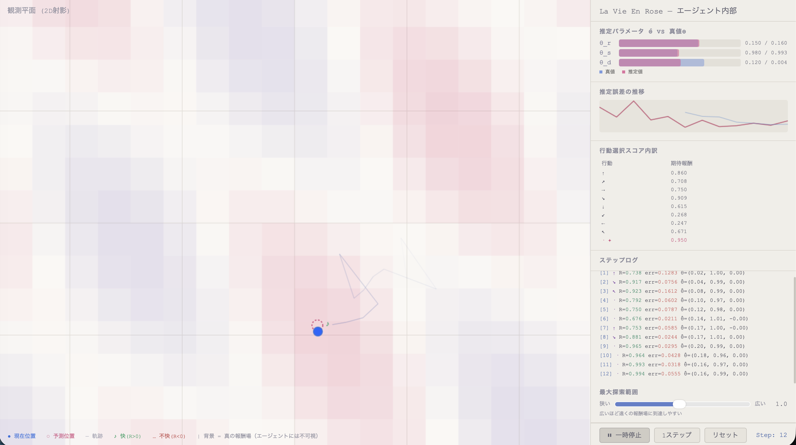

# La Vie En Rose


楽しい人生のための行動選択のモデル化

# [SuperLight版](https://martake.github.io/LaVieEnRose)

## コンセプト

現代社会における人間の行動選択と欲求充足に関し、以下の仮定を実践する面白シミュレーター

- 「主観的には常に合理的選択をしている」が「世界認識が不完全」であるために最大利得を得られていない
- 利得を最大化すると同時に「世界認識」の改善も目指している

## シミュレーターのルール

- 世界（報酬場）は3次元で構成されているが、観測・選択できるのは2Dの影のみ
- エージェントは2Dの観測だけを頼りに、隠れた世界の法則を推定して行動しながら、正しい世界を認識しようとする
- 報酬が期待外れであることは世界認識の正確性に対する脅威である

報酬は見えないZ次元を含む潜在状態で決まる（`R = sin(5z + x) · cos(3z - y)`）ため、
2Dだけ見ていると「理由のない幸運・不運」に見える。

## 数理モデル

```
潜在状態:  s_t ∈ R^3（観測不可）
観測:      o_t = P · s_t            （P: 固定 2×3 射影行列）
遷移:      s_{t+1} = A(θ) · s_t + B · a_t + ε_t
報酬:      R_t = sin(5z + x) · cos(3z - y)  （隠れた次元に依存、散在する報酬場）
```

### パラメータ

| 記号 | 意味      | 真値 | ダイナミクス上の効果   |
| ---- | --------- | ---- | ---------------------- |
| θ_r  | 回転角    | 0.15 | XY平面の回転           |
| θ_s  | スケール  | 0.98 | XY平面の縮小/拡大      |
| θ_d  | Zドリフト | 0.12 | Z方向の加速（係数0.5） |

エージェントはこの3つの未知パラメータを観測だけから推定する。

### 行動選択

9つの候補（8方向＋静止）から、純粋な期待報酬のみで選択:

```
score = 期待報酬（推定モデルに基づく）
```

エージェントは常に「最も報酬が高い」と予測した方向へ移動する。
予測が間違っていれば期待外れの報酬を得る — そのギャップが学習を駆動する。

### 脅威メカニズム

直近10ステップの実績から脅威レベル（0〜1）を算出:

- **報酬予測誤差が大きい** → 世界モデルが現実と乖離している
- **得られる報酬が低い** → 現在の戦略が機能していない

脅威が高いほど学習率を最大5倍にブーストし、世界パラメータを大きく更新する。
これにより明示的な探索ボーナスなしに「世界の再探索」が自然に促進される。

### 状態推定

観測誤差からPの擬似逆行列（`P^+ = P^T(PP^T)^{-1}`）を用いて、
隠れたZ次元を含む潜在状態全体を毎ステップ補正する。
これにより位置予測の精度を保ちつつ、報酬予測の誤差で学習を駆動する。

### 操作

- **▶ / ⏸**: 自動実行の開始・停止（800ms間隔）
- **1ステップ**: 手動で1ステップ進める
- **リセット**: 初期状態に戻す
- **最大探索範囲スライダー**: 行動の大きさを調整（広いほどエージェントが遠くの報酬場に到達しやすい）

### 画面構成



**左 — 観測平面（Canvas）**

- 青丸: エージェントの現在位置
- ピンク点線丸: エージェントの予測位置
- 軌跡: フェードするライン
- 背景ヒートマップ: 真の報酬場（薔薇色=快、紫=不快）— エージェントには不可視

**右 — エージェント内部**

- θ̂ vs θ: 推定値と真値の比較バー
- 誤差グラフ: 予測誤差の推移（下がっていけば学習成功）
- 行動スコア: 各方向の期待報酬
- ステップログ: 各ステップの報酬・誤差・脅威レベル（⚠表示）
