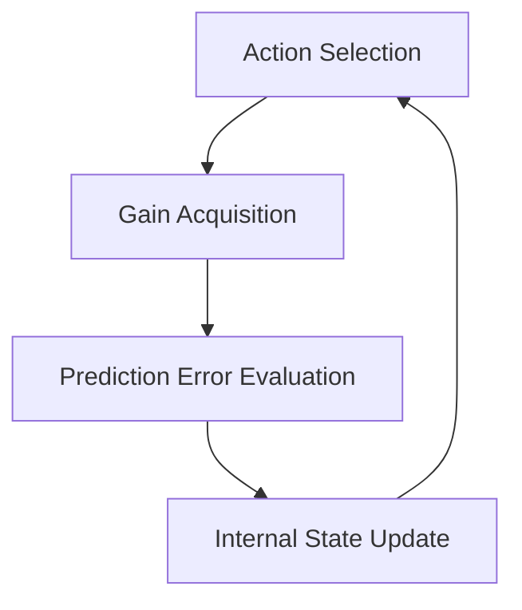

# La Vie En Rose: Bridging Cognitive Models and Mathematical Models

This document aims to organize the action-selection model in _La Vie En Rose_ as a **cognitive model**, and to describe it in a form that can be connected to a **mathematical model** in the future.

## 0. Basic Policy

In modeling _La Vie En Rose_, we are strongly influenced by the structure of the Transformer.
However, references to the Transformer in this paper are not implementation-isomorphic, but rather structural inspirations.

The reasons for adopting the Transformer as the conceptual basis of this model are described below.

The Transformer mathematically models human language understanding and generation, and is widely adopted as the foundational architecture of current LLMs (Large Language Models).
Since systems built on this architecture have already reached a practical stage, we consider that, among existing models, it provides a relatively good approximation of human cognitive functions—particularly the perceptual and decision-making functions of the neocortex.

## 1. Core Philosophy of the Model

- Humans do not act with a complete understanding of the entire world
- What humans possess is a local understanding based on the “here and now” and the immediate context
- Action selection is performed in the direction expected to yield the highest gain under this local understanding
- The discrepancy between action outcomes and expectations becomes the basis for the next update of understanding

This structure is structurally analogous to the idea in Transformers that
“the meaning of a token emerges from its context.”

## 2. Definition of the World

### 2.1 The World as a Virtual World

- The “world” in this model does not reproduce an objectively correct “true world”
- The “world” described here refers to the “personal existential world” in the principles of _La Vie En Rose_
- Depending on the purpose of model construction, the world may take various forms
- Independently of the agent’s perception (the “personal perceived world”), the world exists and transforms according to its own inherent rules

### 2.2 Components of the World

The world consists of the following elements:

- Coordinate space $X$
- Reward generation rules (reward density field)
- Constraint structures (reachable regions, lifespan, action feasibility)
- Gradual transformation (drift)

The state of the world at time $t$ is denoted as $\phi_t$, and it autonomously evolves as

```math
\phi_{t+1} = \mathrm{Drift}(\phi_t) + \xi_t
```

※ $\xi_t$ denotes random noise

## 3. Definition of the Agent

### 3.1 The Agent Does Not Possess the Entire World

- The agent is defined as an entity that cannot fully know the structure of the entire world
- The agent knows only “its own past observations and reward history”
- Internal traits such as personality, temperament, and values are not treated as agent-side parameters
  They are instead considered to be embedded on the world side (reward field, constraints, metrics)

### 3.2 Local Observations and Context

At each time step $t$, the agent obtains only local observations such as:

- Current position $x_t$
- The result obtained at that position (e.g., reward) $r_t$

From the observation history of the most recent $L$ steps,

```math
c_t = (o_{t-L+1}, \ldots, o_t)
```

this sequence constitutes the agent’s “context.”

### 3.3 The Agent’s World Representation

The agent’s “world representation” exists independently of the global model of the world.
Based on the information obtained so far, the agent forms a local understanding such as:

- “Where should I go next?”
- “What kind of relationships seem to exist between my current location and its surroundings?”

This internal representation is denoted as $h_t$.

```math
h_t = \mathrm{Enc}_\theta(c_t)
```

- $\mathrm{Enc}_\theta$ is a function that summarizes the context
- A summarization mechanism inspired by context-dependent representations in Transformers

If this internal representation $h_t$ is “correct,” maximal gains can be obtained stably.
This corresponds to the concept of the “personal perceived world” in _La Vie En Rose_.

## 4. Agent Behavior

The agent behaves as follows:



### Action Selection

Due to the constraint structure, the range of positions the agent can move to at once is defined as $\mathcal{A}(x_t)$.

Using the internal state $h_t$, the agent selects the coordinate expected to yield the highest gain.

```math
x_{t+1} \in \arg\max_{x \in \mathcal{A}(x_t)}
\mathbb{E}[G_{t+1} \mid h_t, x]
```

### Gain Acquisition

```math
\hat{r}_{t+1} = \mathrm{Pred}_\theta(h_t, x_{t+1})
```

### Prediction Error Evaluation

The difference between the predicted value and the realized value is computed as

```math
e_{t+1} = r_{t+1} - \hat{r}_{t+1}
```

The smaller the difference, the more “meaning is maintained” (i.e., the relationship between the world and the self is stable).
Conversely, the larger $e_{t+1}$ becomes, the more “meaning is lost” (the relationship between the world and the self becomes unstable), and the pressure for “meaning update” increases.

This is isomorphic to the next-token prediction loss in Transformers.

### Update of Internal Representation $h_{t+1}$

Using the observation $o_{t+1}$ obtained as a result of coordinate selection, the internal representation is updated by reflecting the discrepancy between the expected gain $\hat{r}_{t+1}$ and the realized gain $r_{t+1}$.

When the discrepancy between expected and realized gain is large, it suggests that the agent’s internal state $h_t$—that is, its “structural equation of the world”—has deviated too much to be explained by small changes, indicating that a major transformation is required.
Therefore, it is reasonable to assume that larger prediction errors should lead to larger updates of the internal representation.
However, this aspect is not explicitly modeled in this paper.

## 5. Summary of Structural Correspondence with the Transformer

| Transformer                  | La Vie En Rose                             |
| ---------------------------- | ------------------------------------------ |
| token self-state at time $t$ | agent internal representation $h_t$        |
| context window               | observation history $c_t$                  |
| embedding                    | local world representation $h_t$           |
| attention                    | weighted integration of experience         |
| next-token prediction        | prediction of action outcomes              |
| loss                         | discrepancy between prediction and outcome |
| weights                      | world generation rules (fixed or evolving) |

## Considérations sur la correspondance avec les phénomènes du monde réel

Dans ce modèle, on suppose que les choix d’action de l’agent visent, à court terme, la maximisation du gain au niveau de la couche Gene et que, par nécessité, ils tendent à long terme vers l’obtention d’un état optimal de l’état interne h_t au niveau de la couche Meme ».

En considérant le monde réel à partir de cette hypothèse, on peut estimer que les phénomènes suivants sont explicables comme des conséquences nécessaires dérivées de la structure du modèle.

- Plus l’information contenue dans la fenêtre de contexte c\*t est riche, plus la précision de h_t est susceptible de s’améliorer.
  Le fait que les êtres humains recherchent des liens et des communautés est donc rationnel également du point de vue de l’efficacité dans ce modèle.
- Plus l’erreur de prédiction e*{t+1} est importante, plus une transformation majeure de h*t devient nécessaire.
  Ainsi, lorsque le monde existentiel connaît de fortes fluctuations, ou lorsque la précision de h_t est mise en doute, le monde intérieur de l’individu est profondément ébranlé.
- Le fait que, dans une même situation, seule une partie des individus adopte des comportements objectivement perçus comme incohérents peut s’expliquer par des changements fréquents et importants de leur représentation interne h_t.
  Du point de vue subjectif de ces individus, leurs choix d’action sont vraisemblablement cohérents et rationnels ».
- Si des comportements sociaux tels que l’ignorance ou le rejet au sein d’un groupe infligent de lourds dommages émotionnels et affectifs à un individu, c’est parce que l’interruption du flux d’informations appauvrit sa fenêtre de contexte c_t par rapport à celle des autres membres du groupe.
  Cela accélère la dégradation relative de la représentation interne h_t et rend plus probable une augmentation de l’erreur de prédiction e\*{t+1}.
  Lorsque l’ignorance ou le rejet ne s’accompagnent pas de ce phénomène, leur impact émotionnel est relativement limité.
- Les interactions avec de multiples autres personnes, la construction de relations sociales, ainsi que la lecture, la consultation de l’actualité, l’apprentissage ou les voyages contribuent à la santé mentale, car ils enrichissent la fenêtre de contexte c_t.
- L’afflux d’informations contradictoires, comme dans le cas d’un double bind, perturbe l’orientation de l’ajustement de la représentation interne h_t et entraîne une instabilité dans les choix d’action de l’individu.
  De plus, comme c_t se forme par l’accumulation des expériences passées, l’influence d’informations contradictoires reçues antérieurement peut continuer à affecter durablement la précision de h_t.
- Lorsque des actions entreprises dans l’attente de gratitude ou de reconnaissance aboutissent effectivement à la gratitude ou à la reconnaissance espérées, la confiance de l’individu dans sa propre représentation interne h_t s’accroît, tout comme l’attente que la représentation interne h_t de l’autre soit stable à son égard.
  Ainsi, le désir humain de vouloir être avec des personnes qui expriment gratitude et reconnaissance est rationnel.
